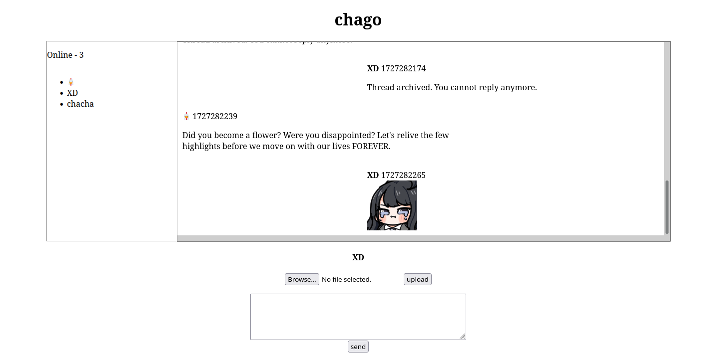

#  chago

go websocket chat room 





## dev

* ```github.com/gorilla/websocket```

* [websocket chat room](https://www.topgoer.com/%E7%BD%91%E7%BB%9C%E7%BC%96%E7%A8%8B/WebSocket%E7%BC%96%E7%A8%8B.html)

* [Multi-room Chat Application With WebSockets In Go And Vue.js (Part 2)](https://www.whichdev.com/building-a-multi-room-chat-application-with-websockets-in-go-and-vue-js-part-2/)

* [samples-server](https://github.com/mdn/samples-server/blob/master/s/websocket-chat/)


### finished

* online users
* upload image through http
* broadcast messages separate others and myself


### todo

* heartbeat
* rooms
* config file
* DB